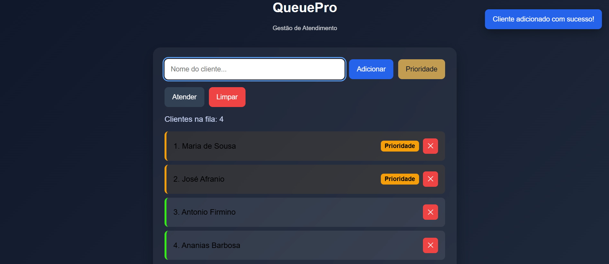
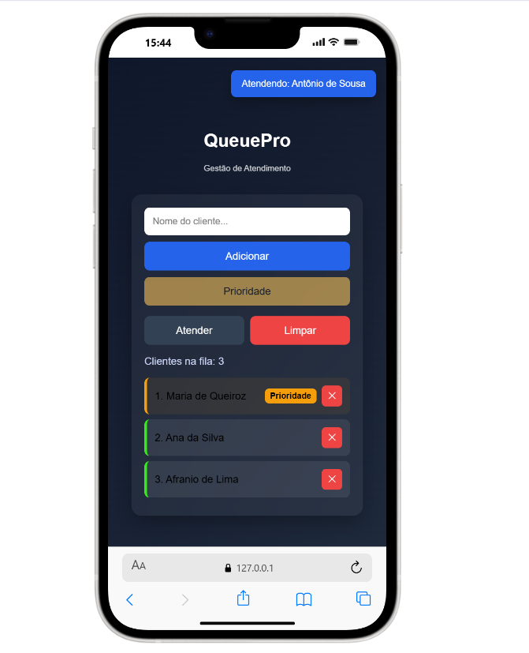

# QueuePro

Projeto de portfólio desenvolvido para praticar lógica de filas, modularização em JavaScript e melhorias de UX em uma interface responsiva.

Sistema web de gerenciamento de filas com suporte a prioridade, persistência local e feedback visual para ações do usuário.

## Sobre o projeto

O QueuePro simula um cenário real de atendimento, permitindo adicionar clientes à fila, marcar prioridades, atender o próximo cliente, remover itens específicos e manter os dados salvos no navegador.

O objetivo do projeto foi praticar lógica de fila, manipulação de DOM, organização de código em módulos e construção de uma interface responsiva com foco em experiência do usuário.

## Preview

## Funcionalidades

- Adição de clientes na fila
- Adição de clientes prioritários
- Atendimento do próximo cliente
- Remoção individual de clientes
- Persistência dos dados no navegador com localStorage
- Toasts para feedback de ações
- Estado vazio orientativo
- Interface responsiva
- Feedback visual para foco e estados de botão

## Tecnologias utilizadas
- HTML5
- CSS3
- JavaScript
- LocalStorage

## Decisões técnicas
### Prioridade estável

Clientes prioritários entram antes dos clientes normais, mas respeitando a ordem de chegada entre os próprios prioritários.

### Persistência local

A fila é salva no navegador usando localStorage, permitindo manter o estado mesmo após recarregar a página.

### Organização modular

A aplicação foi separada por responsabilidade:

- main.js: eventos e coordenação da tela
- ui.js: renderização da interface
- queue.js: regras da fila
- state.js: estado inicial
- storage.js: persistência

### UX e acessibilidade
- Toast para feedback de ações
- Estado vazio com orientação
- label semântico no input
- aria-label no botão de remover
- aria-live no toast
- foco visível para navegação por teclado

## Como executar o projeto

### Opção 1 — abrir localmente

Basta abrir o arquivo index.html no navegador.

### Opção 2 — usar Live Server

Se estiver usando o VS Code, rode com a extensão Live Server para facilitar os testes.

## Aprendizados

### Com este projeto, pratiquei:

- modelagem de regra de negócio
- manipulação de arrays com prioridade
- atualização dinâmica da interface
- persistência de estado no navegador
- organização modular em JavaScript
- melhorias de experiência do usuário
- refinamento visual e responsividade

## Próximos passos

- adicionar geração de senha para atendimento
- exibir histórico de clientes atendidos
- implementar métricas da fila
- evoluir a interface para uma versão em React

## Deploy

[Visualizar projeto online](https://atendimento-para-filas.vercel.app)

## Autor

Desenvolvido por Fadecio Lemos.

- GitHub: https://github.com/Fadecio
- LinkedIn: https://linkedin.com/in/fadecio-lemos